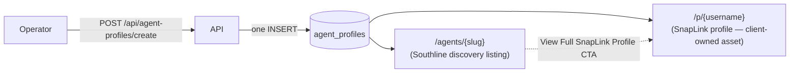

# Agent Management — Architecture

Implementation slice adding a real operator-facing **Agent Management System**
on top of the existing `lib/agent-profiles` module. An operator can create,
configure, preview, publish, edit, suspend, and archive an agent, so that
**SnapLink** is the agent's self-contained client asset and **Southline
Living** is a discovery/referral layer that only *references* it.

## Architecture

One table, `agent_profiles`, remains the single source of truth for the
account, the SnapLink profile, and the Southline listing — there is no
separate "user" table. This keeps the model additive and avoids introducing a
second identity system alongside the existing contractor one.

SnapLink never depends on Southline: `app/p/[username]/page.tsx` renders
`AgentProfilePublicPage` directly, with no import of
`components/southline/Header` or `Footer`. Southline's `/agents/[slug]` page
renders the same component with `variant="southline"`, which adds a CTA back
to the full SnapLink profile plus booking/website links.

## Ownership: SnapLink vs. Southline

| Concern | Owner | Field(s) |
|---|---|---|
| Identity / login (account) | Account | `status`, `pin` |
| Contact channels, bio, modules, entitlements | SnapLink | `smsPhone`, `whatsapp`, `website`, `bookingLink`, socials, `modules` |
| Discovery listing, marketplace SEO, featured flag | Southline | `southlineStatus`, `featured`, `categories`, `neighborhoods`, `seoTitle`, `seoDescription`, `marketplaceSummary` |

`username` (SnapLink identity, `/p/{username}`) and `slug` (Southline
identity, `/agents/{slug}`) are deliberately two different identifiers, each
validated and reserved independently (see `lib/agent-profiles/identity.ts`).

## Status model — four separate axes

Never overload one field for all of these:

- **Account** (`AgentProfileStatus`): `pending | active | suspended | archived`
- **SnapLink** (`SnaplinkStatus`): `draft | published | unpublished`
- **Southline** (`SouthlineStatus`): `draft | published | featured | hidden`
- **Onboarding** (`OnboardingStatus`): `not_started | invited | profile_incomplete | ready | approved | launched`

Suspending or archiving an agent (account axis) hides them everywhere,
regardless of the SnapLink/Southline publish state. Publishing SnapLink and
Southline are independent decisions an operator makes per channel.

## Workflow

1. Operator opens **Agent Management** (`/southline/admin` → Agent Management
   tab) and clicks **+ New Agent**.
2. `/southline/admin/agents/new` collects Shared Professional Identity, Real
   Estate Details, Southline Living Listing, and SnapLink Workspace and
   Modules fields, live-validating username/slug/email uniqueness via
   `GET /api/agent-profiles/check`.
3. `POST /api/agent-profiles/create` (operator-only) validates everything
   server-side and performs **one INSERT** creating the account, SnapLink
   profile, and Southline listing together. Because it is a single row
   insert, there is no multi-step transaction to roll back — either the row
   is created, or the request fails before any write happens.
4. The success screen shows the generated SnapLink URL (`/p/{username}`) and
   Southline URL (`/agents/{slug}`), with copy/preview/edit actions.
5. The operator edits the agent later at `/southline/admin/agents/{id}`, the
   same form pre-filled, using `PATCH /api/agent-profiles/{id}`.
6. Publish/Unpublish/Suspend/Reinstate/Archive/Restore are one-click actions
   from the Agent Management table, each requiring confirmation since they
   change an agent's visibility or account access. "Manage Modules" toggles
   entitlements inline without leaving the table; "Open Workspace" jumps to
   the Edit page's SnapLink Workspace and Modules section.

The Agent Management table also surfaces, per row: photo/avatar fallback,
display name, brokerage, office/team, account status, SnapLink status,
Southline status, onboarding status, enabled module count, and last-updated
timestamp. There is no permanent-delete action — Archive is the only
removal path, and it is soft/reversible via Restore.

## URLs

- SnapLink profile: `/p/{username}` — no locale prefix; language is cookie-driven (`sl_lang`), same as the rest of Southline Living.
- Southline discovery listing: `/agents/{slug}` — existing route, now gated on `southlineStatus` instead of only account `status`.
- Both `username` and `slug` are checked against `RESERVED_IDENTIFIERS`
  (every existing top-level `app/` route segment) so a professional can never
  shadow an app route.

## Publishing

- SnapLink publish (`snaplinkStatus`) and Southline publish
  (`southlineStatus`) are independent per-channel switches — an agent's
  SnapLink page can be live while their Southline discovery listing stays in
  draft, or vice versa.
- The Agent Management table's **Publish** action sets both to `published`
  and moves `onboardingStatus` to `launched`, as the common case; **Unpublish**
  reverses this (`snaplinkStatus` → `unpublished`, `southlineStatus` →
  `hidden`) without touching the account status; the Edit page allows
  setting either status independently for finer control.

## Entitlements

New, separate `AgentModuleKey` type
(`booking | leads | campaigns | flipbooks | invoices | money | analytics | qr | nfc`)
stored as a JSONB `modules` column directly on `agent_profiles`. This is
**intentionally not** the existing contractor `ModuleKey` /
`professionalModuleEntitlements` system (`lib/entitlement-types.ts`,
`lib/entitlements.ts`) — that system stays untouched, and agents get their
own, unrelated module set.

## Field ownership (Create/Edit form)

The shared `AgentForm` component groups every field into four visibly
labeled sections, matching the ownership table above:

- **Shared Professional Identity** — first/last/display name, username,
  slug, email, phone, preferred + supported languages, profile/cover photo,
  PIN.
- **Real Estate Details** — title/tagline, brokerage, office, team, license
  number/state, years of experience, specialties, service areas, biography.
- **Southline Living Listing** — Southline publication status, featured
  placement, categories, neighborhoods, service radius, SEO title/
  description, marketplace summary.
- **SnapLink Workspace and Modules** — SnapLink publication status, tier,
  profile/workspace link previews, Contact Methods (SMS, WhatsApp, website,
  booking link, socials), and enabled modules.

## Testing

`tests/agent-management.test.mjs` (run via `npm run test:agent-management`,
which also re-runs `tests/agent-profiles.test.mjs`) statically asserts:

- The 0021 migration is additive-only (no `DROP`/`TRUNCATE`/`DELETE`).
- `username` is nullable with no default (required so a unique index doesn't
  collide on existing rows' empty strings).
- The four status-axis types and `AGENT_MODULE_KEYS` exist.
- `identity.ts` exports the expected helper functions.
- `POST /api/agent-profiles/create` is a **separate, operator-gated** route —
  the original public `POST /api/agent-profiles` handler still contains no
  `isOperator` check anywhere (preserving the pre-existing regression test's
  invariant).
- `GET /api/agent-profiles/check` requires the operator PIN.
- The `[id]` PATCH route keeps `onlySelfEditable`, still requires
  `isOperator(pin)` for operator actions, and now accepts `archived` status
  and a `modules` merge.
- `/p/[username]` never imports the Southline `Header`/`Footer`.
- `/agents/[slug]` gates on `southlineStatus`.
- Agent-management code doesn't import contractor or multi-tenant real-estate
  internals, and the new modules system stays separate from the contractor
  entitlements system.

## Acceptance criteria

- [x] Operator can create an agent with one PIN-protected request.
- [x] Duplicate username/slug/email is rejected (409) before any write.
- [x] SnapLink profile and Southline listing are both created from the same
      operation, with generated URLs returned immediately.
- [x] Draft agents are hidden from `/p/{username}` and `/agents/{slug}`;
      published/featured agents are visible; suspended/archived agents are
      hidden everywhere regardless of publish state.
- [x] Editing works via the same form, pre-filled, via `PATCH`.
- [x] Modules can be assigned/toggled per agent without clearing existing ones (merge, not overwrite).
- [x] Unauthorized (non-operator, non-owning-PIN) requests are rejected.
- [x] Existing agent-profiles behavior (public request form, self-edit,
      analytics events, billing wrapper) is unmodified and its regression
      tests still pass unchanged.

## Known deviations from the literal spec

- Implemented under `/southline/admin/agents/*` rather than a literal
  top-level `/admin/agents/*`, to follow this repo's existing routing
  convention (all CMS/admin surfaces live under `/southline/admin`).
- Scoped to the existing `lib/agent-profiles` module (real-estate agents)
  rather than building a new, fully unified cross-vertical "Professional"
  entity — the pragmatic, lower-risk scope for one implementation slice.
  The follow-up **Unified Professional Profile** slice built on that same
  model instead of forking it: the taxonomy now covers every home-service
  profession (incl. `photographer`) and the public/directory/form/admin
  surfaces render profession-agnostic copy — see
  `docs/architecture/UNIFIED_PROFESSIONAL_PROFILE.md`.
- "Agent receives invitation" is implemented as an operator-set 6-digit PIN
  plus copyable SnapLink/Southline URLs shown on the creation success screen
  — not an actual email send. No email-sending infrastructure exists
  anywhere in this repo today; adding one was out of scope for this slice.

## Known issues / required manual step

- None. Migration `0021_agent_management_identity` has been applied to the
  live database (verified: schema columns/indexes match the migration file,
  targeted tests pass, and create/edit/publish/suspend/lookup flows were
  exercised against the real database). A backfill
  (`southline_status = 'published' WHERE status = 'active'`) was applied in
  the same transaction so pre-existing published agents were not silently
  hidden by the new `southlineStatus` gate.

## Recommended next slice

- Real email delivery for the "Agent receives invitation" step (magic-link
  PIN setup instead of an operator-typed PIN).
- Bulk actions (bulk publish/suspend) on the Agent Management table.
- Audit log of status/publish changes per agent, reusing the existing
  `agent_profile_events` table.
