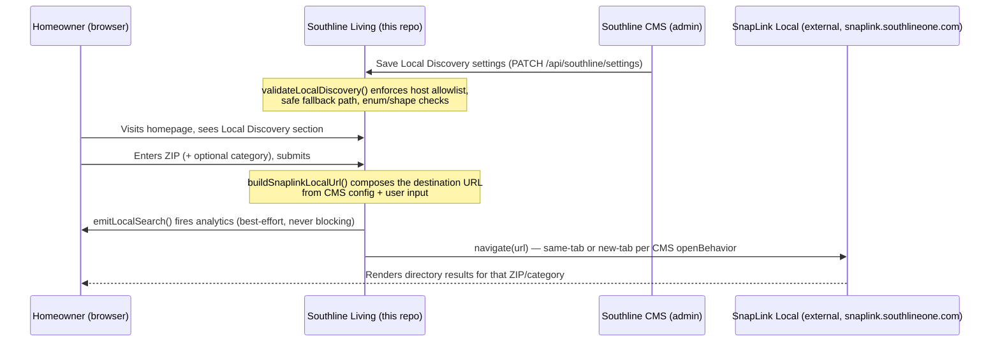

# Architecture

## Master/subordinate toggle model

`SouthlineLocalDiscoveryContent.enabled` is the master switch:

- **`enabled: false`** → `LocalDiscovery.tsx` renders `null` immediately.
  `showOnHomepage` and `showCategoryCards` are read but structurally cannot
  matter — the component returns before either is evaluated for rendering.
  Their values are preserved in storage so nothing is lost while disabled.
- **`enabled: true`** → `showOnHomepage` gates whether `app/page.tsx` mounts
  the section at all; `showCategoryCards` gates whether the category-card
  grid renders inside it (the ZIP form always renders when enabled).

This is enforced identically in two places so the CMS status badge and the
live site can never disagree:

- `computeLocalDiscoveryStatus()` in [lib/southline-local-discovery.ts](../../lib/southline-local-discovery.ts) — used by both the CMS status badge and the Diagnostics panel.
- The early-return guard at the top of `LocalDiscovery.tsx`.

## Status enum

`computeLocalDiscoveryStatus()` returns one of:

| Status | Meaning |
|---|---|
| `hidden` | Master toggle (`enabled`) is off. Nothing renders publicly. |
| `misconfigured` | `directoryBaseUrl` is malformed or not on the SnapLink host allowlist, **or** `fallbackUrl` is not a safe internal path. |
| `warning` | Feature is on but not fully healthy: `showOnHomepage` is off, or every visible category card lacks a SnapLink category mapping. |
| `ready` | Enabled, on the homepage, base URL valid, and at least one visible category (if any) is mapped. |

## Request flow inside `LocalDiscovery.tsx`

1. User submits ZIP (validated client-side via `isValidUsZip`) and/or clicks
   a category card.
2. `resolveSnaplinkCategory()` looks up `category.snaplinkCategory`; if
   unmapped, the category param is **omitted** (never guessed) and a
   `console.warn` is logged.
3. `directoryUrl()` calls `buildSnaplinkLocalUrl()` with the full CMS bridge
   configuration (route, param names, source/placement values, locale,
   UTM/attribution toggles).
4. `emitLocalSearch()` fires the `local_search_submitted` analytics event
   (component callback + DOM event), wrapped in independent `try/catch`
   blocks so a consumer's analytics failure never blocks step 5.
5. `navigate(url)` opens the URL in the same tab or a new tab per the CMS
   `openBehavior` setting.
